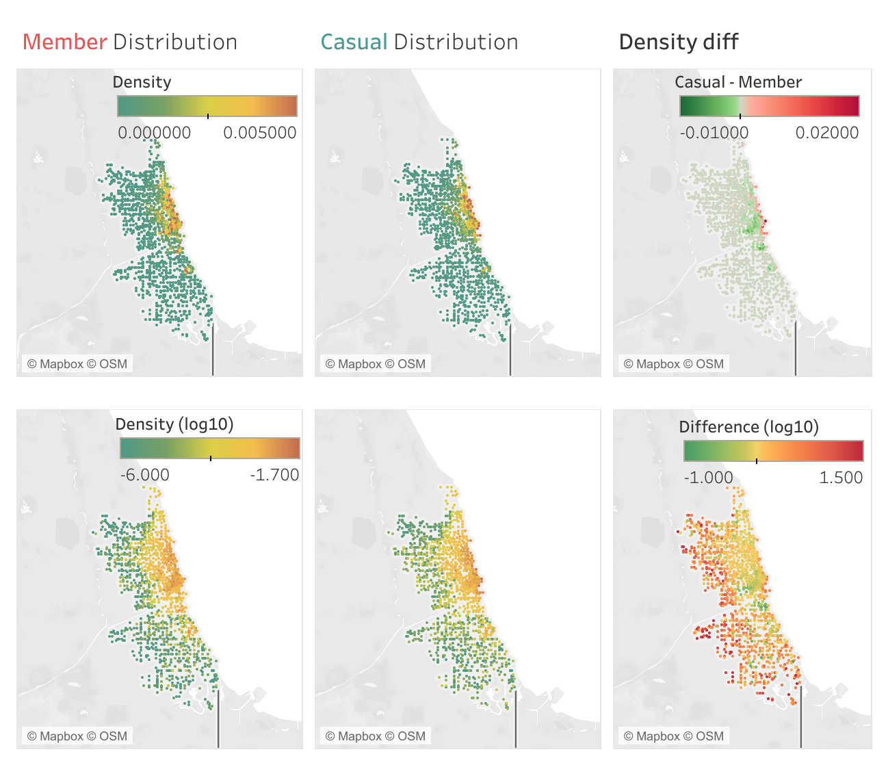

<hr style="border:1px solid lightgrey">

## Environment Setup

First let's export the cleaned data table for [R]{style="background-color: lightgrey"}. Due to [BigQuery SANDBOX]{style="background-color: lightgrey"} can only export `.csv` file with size limit to 1GB, we need to try to reduce the file size:

```{sql export cleaned data, eval = FALSE}
/* Purpose: reduce file size to export to .csv */
SELECT
  ride_id,
  CASE /* bike_type */
    WHEN bike_type = 'classic_bike' THEN 'c'
    WHEN bike_type = 'electric_bike' THEN 'e'
    WHEN bike_type = 'docked_bike' THEN 'd'
    ELSE bike_type
  END AS bike_type,
  CASE /* customer_type */
    WHEN customer_type = 'casual' THEN 'c'
    WHEN customer_type = 'member' THEN 'm'
    ELSE customer_type
  END AS customer_type,
  start_datetime,
  end_datetime,
  start_station_name,
  start_station_id,
  end_station_name,
  end_station_id,
  ROUND(start_lat, 6) AS start_lat,
  ROUND(start_lng, 6) AS start_lng,
  ROUND(end_lat, 6) AS end_lat,
  ROUND(end_lng, 6) AS end_lng
FROM `data-analytics-case1.process.cleaned-divvy-tripdata` 
```

The result is exported to file `cleaned-divvy-tripdata.csv`. The file size is 859.6MB, just nice. Now we can import it into [R]{style="background-color: lightgrey"}.

```{r global option, include=FALSE}
knitr::opts_chunk$set(eval = TRUE)
```


```{r library, message=FALSE, warning=FALSE}
library(tidyverse)
library(ggmap)
library(patchwork)
library(geomtextpath)
# This package is not from CRAN, but from github
# install.packages("remotes")
# remotes::install_github("AllanCameron/geomtextpath")
```

```{r import data}
ride_df <- read_csv('data/cleaned-divvy-tripdata.csv', 
                    show_col_types = FALSE) %>% 
  mutate( #restore alias for easy understanding
    customer_type = case_when(
      customer_type == "c" ~ "Casual",
      customer_type == "m" ~ "Member"
    ) %>% as_factor(),
    bike_type = case_when(
      bike_type == "c" ~ "Classic",
      bike_type == "e" ~ "Electric",
      bike_type == "d" ~ "Docked"
    ) %>% as_factor(),
    #convert string to datetime
    start_datetime = ymd_hms(start_datetime),
    end_datetime = ymd_hms(end_datetime)
  )

glimpse(ride_df)
```

```{r mutate}
## Summarize all mutate commands here for future new column definition.
## Purpose is to reduce process time by preventing repeat calculations. 
ride_df <- ride_df %>% 
  mutate(
    month = sprintf(
      "%d-%02d", 
      year(start_datetime), 
      month(start_datetime)
    ),
    day = day(start_datetime),
    weekday = if_else(
      between(wday(start_datetime), 2, 6),
      "weekday",
      "weekend"
    ),
    start_hour = hour(start_datetime) + 
      minute(start_datetime) / 60 +
      second(start_datetime) / 3600,
    
    time_cat = case_when(
      weekday == "weekday" & 
        (between(start_hour, 7, 10) | between(start_hour, 16, 19)) 
        ~ "Peak hours",
      weekday == "weekday" & between(start_hour, 6, 21)
        ~ "weekday day",
      weekday == "weekend" & between(start_hour, 6, 21)
        ~ "weekend day",
      .default = "Night"
    ),
    duration = as.numeric(
      difftime(end_datetime, start_datetime, units = "mins")
    ),
    dur_cat = case_when(
      duration < 10 ~ "Short",
      between(duration, 10, 20) ~ "Mid",
      .default = "Long"
    )
  )

invisible(gc()) # free up memory
```

\

---

## Member vs. casual ride ratio

```{r Fig 3.1 ratio of member, fig.height=2, fig.width=6, fig.cap="Figure 3.1: Customer Type Ratio", fig.align='center'}
ride_df %>% 
  group_by(customer_type) %>% 
  summarise(n = n()) %>% 
  mutate(ratio = n / sum(n)) %>% 
  ggplot(aes(x = ratio, y = '', fill = customer_type)) +
  geom_col() +
  geom_text(
    aes(label = str_c(
      customer_type,
      ": ",
      round(ratio*100,1), 
      "%"
      )
    ), 
    position=position_stack(vjust=0.5)
  ) +
  labs(
    title = "Casual vs. member ride ratio",
    y = "",
    fill = "Customer",
    caption = "NOTE: Calculate from trip counts."
  ) +
  theme(
    axis.ticks.y = element_blank(),
    axis.title.y = element_blank(),
    plot.caption.position = "plot",
    legend.position = "none"
  )
```

```{r, include=FALSE}
invisible(gc()) # free up memory
```

Please note this ratio is calculated from total rides. Since logically annual members should ride more often than casual riders, the actual casual customer ratio must be much bigger than 36.3%.

\

---

## Seasonal pattern on trip count

Let's see how annual member ratio change in this whole year range:

```{r Fig 3.2 member ratio time trend, fig.cap="Figure 3.2: Monthly trend of anual member ratio", fig.align='center'}
ride_df %>% 
  group_by(month, customer_type, day) %>% 
  summarise(n = n(), .groups = "drop_last") %>% 
  ## compensate for different number of days in each month
  summarise(n = mean(n), .groups = "drop_last") %>% 
  mutate(ratio = n / sum(n)) %>%
  filter(customer_type == "Member") %>% 
  ungroup() %>% 
  ggplot(aes(x = month, y = ratio)) +
  geom_col(fill = "lightblue") +
  geom_smooth(
    aes(group = 1), 
    formula = y ~ x, 
    method = "loess", 
    se = FALSE
  ) +
  geom_texthline(
    yintercept = 0.637,
    label = "Average: 63.7%",
    hjust = 0.15, 
    color = "red4",
    linetype = 2
  ) +
  ylim(0, 1) +
  theme(
    axis.text.x = element_text(
      angle = 45, vjust = 1, hjust=1)
  ) +
  labs(
    title = "Member ride ratio: Monthly trend",
    x = "Month",
    y = "Ratio"
  )
```

```{r, include=FALSE}
invisible(gc()) # free up memory
```

Very clear seasonal pattern! Member ride ratio is high ([max 79.0%]{style="background-color: lightblue"}) in winter and low ([min 56.8%]{style="background-color: lightblue"}) in summer. To understand the mechanism, let's check the ride count seasonal pattern instead:

```{r Fig 3.3 normalized trip count monthly trend, fig.align='center', fig.cap='Figure 3.3: Normalized trip count monthly trend'}
ride_df %>% 
  group_by(customer_type, month, day) %>% 
  summarise(n = n(), .groups = "drop_last") %>% 
  ## compensate for different number of days in each month
  summarise(n = mean(n), .groups = "drop_last") %>% 
  mutate(norm_n = n / max(n)) %>% 
  ggplot(aes(x = month, 
             y = norm_n, 
             fill = customer_type,
             color = customer_type,
             shape = customer_type)
         ) +
  geom_point(size = 3) +
  geom_smooth(
    aes(group = customer_type, linetype = customer_type), 
    formula = y ~ x, 
    method = "loess", 
    se = FALSE
  ) +
  geom_texthline(
    yintercept = 1,
    label = "Normalized to summer count",
    hjust = 0.1, 
    vjust = 1.1,
    color = "red4",
    linetype = 1
  ) +
  theme(
    axis.text.x = element_text(
      angle = 45, 
      vjust = 1, 
      hjust=1
    )
  ) + 
  ylim(0, 1) +
  labs(
    title = "Trip count moving trend",
    x = "Month",
    y = "Normalized trip count",
    fill = "Customer",
    color = "Customer",
    shape = "Customer",
    linetype = "Customer"
  )
```

```{r, include=FALSE}
invisible(gc()) # free up memory
```

Both casual and member customers ride more in summer than winter, but the season effect is much stronger on casual riders.

The logic behind may be:

-   Low temperature and bad weather in winter prevent riding.
-   More annual members decide to carry on riding in winter to make full use of the membership.

[Idea:]{style="background-color: orange;"} To put up promotion to encourage casual riders convert to annual membership, [summer is the suitable timing]{style="background-color: yellow;"}!

\

---

## Bike type preference

```{r Fig 3.4 bike type, fig.align='center', fig.cap='Figure 3.4: Bike type preference'}
ride_df %>% 
  group_by(customer_type, bike_type, .drop = FALSE) %>% 
  summarise(n = n(), .groups = "drop_last") %>% 
  mutate(
    ratio = n / sum(n),
    text = sprintf("%.1f%%", ratio * 100)
  ) %>% 
  ggplot(aes(x = bike_type, y = ratio)) +
  geom_col(
    aes(fill = customer_type), 
    position = "dodge", 
    width = 0.7, 
    color = "Black"
    ) +
  geom_text(
    aes(group = customer_type, label = text), 
    vjust = -0.7, 
    colour = "red3", 
    size = 3, 
    position = position_dodge(.7)
    ) +
  ylim(0, 1) +
  labs(
    fill = "Customer",
    x = "Bike type",
    y = "Ratio",
    title = "Bike type preference"
  )
```

```{r, include=FALSE}
invisible(gc()) # free up memory
```

-   Docked bikes are only used by casual riders
    -   I don't know the details on docked bike, so it will be ignored in some of the analysis below.
-   Looks like casual riders have slightly higher preference to electric bikes compare to annual members.
    -   It's hard to tell if the difference is significant, so let's check if there is a seasonal trend.

```{r Fig 3.5 bike type ratio moving trend, fig.align='center', fig.cap='Figure 3.5: Electric bike ratio moving trend'}
ride_df %>% 
  filter(bike_type != 'Docked') %>% 
  group_by(month, customer_type, bike_type, day, .drop = TRUE) %>% 
  summarise(n = n(), .groups = "drop_last") %>% 
  ## compensate for different number of days in each month
  summarise(n = mean(n), .groups = "drop_last") %>%
  mutate(ratio = n / sum(n)) %>% 
  filter(bike_type == "Electric") %>% 
  ggplot(aes(x = month,
             y = ratio,
             fill = customer_type,
             color = customer_type,
             shape = customer_type
            )) +
  geom_point(size = 2) +
  geom_smooth(
    aes(group = customer_type, linetype = customer_type), 
    formula = y ~ x, 
    method = "loess", 
    se = FALSE, 
    linewidth = .7
    ) +
  theme(
    axis.text.x = element_text(angle = 45, vjust = 1, hjust=1),
    plot.caption.position = "plot"
    ) + 
  ylim(0, 1) +
  labs(
    title = "Electric bike ratio moving trend",
    caption = "NOTE: Docked bikes are ignored in this analysis",
    x = "Month",
    y = "Electric bike ratio",
    fill = "Customer",
    color = "Customer",
    shape = "Customer",
    linetype = "Customer"
  )
```

```{r, include=FALSE}
invisible(gc()) # free up memory
```

-   Casual riders consistently use electric bike more than annual members. This preference is **significant**.
-   \~50% of annual member trips were on electric bikes, the ratio was stable through out the year.
-   Casual riders' preference towards electric bike was reducing and the gap to annual members was shrinking
    -   Maybe **casual riders** choose classic bikes more and more for **healthy life style**. If this is the real cause, then [promoting healthy life style by using Cyclistic bikes for exercise]{style="background-color: yellow;"} will be helpful to convince casual riders to sign up annual membership.
    -   We cannot rule out other possible causes, e.g. availability of electric bikes, price difference between classic and electric bikes for casual rides, etc. **More data is necessary** to find out the real root cause of this trend.

We can also study if there is any bike type preference difference between weekdays and weekends:

```{r Fig 3.6 bike type weekday vs weekend, fig.align='center', fig.cap='Figure 3.6: Bike type preference: weekday vs. weekend', warning=FALSE}
ride_df %>% 
  group_by(customer_type, weekday, bike_type) %>% 
  summarise(n = n(), .groups = "drop_last") %>% 
  mutate(ratio = n / sum(n)) %>% 
  ggplot(aes(
    x = weekday,
    y = ratio,
    fill = bike_type,
    color = bike_type
  )) +
  geom_col(alpha = .2) +
  facet_wrap(~ customer_type) +
  geom_text(
    aes(label = if_else(
      ratio > 0.1, 
      str_c(round(ratio*100,1), "%"), 
      NA)), 
    position=position_stack(vjust = 1.15)
  ) +
  geom_text(
    aes(label = if_else(
      ratio <= 0.1, 
      str_c(round(ratio*100,1), "%"), 
      NA)), 
    position=position_stack(vjust = 2.2)
  ) +
  labs(
    fill = "Bike type",
    color = "Bike type",
    title = "Bike type preference: weekday vs. weekend"
  ) +
  scale_y_continuous(breaks = seq(0, 1, .2), limits = c(0, 1.1)) +
  theme(
    axis.title.x = element_blank()
  )
```

```{r, include=FALSE}
invisible(gc()) # free up memory
```

-   **Annual member** behavior is [comparable between weekdays and weekends]{style="background-color: gold"}.
-   **Casual rider**'s bike preference [slightly shift towards classic bikes on weekends]{style="background-color: gold"}.
    -   On [weekdays]{style="background-color: yellow"} **casual riders** have higher preference (compare to **annual members**) towards [electric bikes]{style="background-color: yellow"}, likely due to their [convenience for ad-hoc trip]{style="background-color: yellow"} requirement.
    -   On [weekends]{style="background-color: yellow"} shows higher ratio (compare to weekdays) of [classic bike]{style="background-color: yellow"} choice, likely due to [more exercise trips]{style="background-color: yellow"} for **casual riders**

\

---

## Daily trip start time distribution

Let's study the trip time distribution within a day. It is necessary to plot weekday and weekend trend separately.

```{r Fig 3.7 trip start time distribution, fig.align='center', fig.cap='Figure 3.7: Daily trip start time distribution'}
ride_df %>% 
  ggplot(aes(x = start_hour)) +
  geom_histogram(
    aes(fill = customer_type), 
    binwidth = 1/12, 
    position = "identity", 
    alpha = .2
  ) +
  geom_density(
    aes(y=1/12 * after_stat(count), color = customer_type), 
    linewidth = 1.0
    ) +
  scale_x_continuous(breaks=seq(0,24,2)) +
  facet_wrap(~ weekday,scales = "free_y", nrow = 2) +
  geom_vline(xintercept = c(7,10,16,19)) +
  labs(
    title = "Daily trip start time distribution",
    x = "Hour",
    y = "Count",
    fill = "Customer",
    color = "Customer",
    caption = "bin width = 5 min"
  ) +
  theme(plot.caption.position = "plot")
```

```{r, include=FALSE}
invisible(gc()) # free up memory
```

-   On [weekdays]{style="background-color: gold;"} we can observe 2 traffic peaks at \~8am and \~5pm.
    -   Afternoon peak is higher and broader than morning, meaning many customers like to ride after work but not before work. 
        -   One possible reason is that morning schedule is tight so people prefer faster commute options than bike. After work people like to ride home for the purpose of exercise and relaxation. 
    -   More **Annual member** than **casual rider** ride at peak hours, so this is one of the main reasons of why they sign up membership.
        -   Still a significant amount of [**casual riders** ride at peak hours. They can be the target of ads promoting the benefit of annual membership]{style="background-color: yellow;"}.
    -   On weekday there is another small peak at \~1pm, likely related to lunch break.
-   On [weekends]{style="background-color: gold;"} there is no peak hour pattern. We do observe **annual members** ride more than **casual riders** at early morning and late afternoon.
    -   It may indicate **annual members** have healthier living style with longer outdoor activities on weekends.
    -   [Promote healthy life style may be helpful to convince **casual riders** to sign up annual membership]{style="background-color: yellow;"}.
    
\

#### Trip start time categories

For the ease of future analysis, let's put trip start time into below categories:

1.    **Peak hours**: Weekday [ONLY]{style="color: red;"}: 7~10am and 4~7pm
2.    **Weekday day**: Weekday 6am ~ 9pm [excluding]{style="color: red;"} peak hours
3.    **Weekend day**: Weekend 6am ~ 9pm
4.    **Night**: Daily 9pm ~ 6am (next day)

Now let's check the bike type preference in these start time categories.

```{r Fig 3.8 bike type vs time cat, fig.align='center', fig.cap='Figure 3.8: Bike type vs. start time', warning=FALSE}
ride_df %>% 
  group_by(customer_type, time_cat, bike_type) %>% 
  summarise(n = n(), .groups = "drop_last") %>% 
  mutate(ratio = n/sum(n)) %>%
  ggplot(aes(
    x = time_cat, 
    y = ratio, 
    color = bike_type, 
    fill = bike_type
    )
  ) +
  geom_col(
    aes(),
    alpha = .2
  ) +
  facet_wrap(~ customer_type) +
  geom_text(
    aes(label = if_else(
      ratio > 0.1, 
      str_c(round(ratio*100,1), "%"), 
      NA)), 
    position=position_stack(vjust = 1.15),
    size = 3
  ) +
  geom_text(
    aes(label = if_else(
      ratio <= 0.1, 
      str_c(round(ratio*100,1), "%"), 
      NA)), 
    position=position_stack(vjust = 2.2),
    size = 3
  ) +
  scale_y_continuous(breaks = seq(0, 1, .2), limits = c(0, 1.1)) +
  labs(
    title = "Bike preference at different timing",
    fill = "Bike type",
    color = "Bike type",
    caption = "* weekday day: peak hours are NOT included"
  ) +
  theme(
    axis.text.x = element_text(angle = 30, vjust = 1, hjust=1),
    axis.title.x = element_blank(),
    plot.caption.position = "plot"
    )
```

```{r, include=FALSE}
invisible(gc()) # free up memory
```

-   At ***night*** more electric bikes are preferred.
    -   Maybe because the customers are tired at night
-   Overall **annual members** classic bike preference is significantly higher than **casual riders**.
-   On ***weekends*** **casual riders** show more interest in classic bikes than on ***weekdays***.
    -   Looks like more **casual riders** prefer healthier life style on ***weekends*** than ***weekdays***.

\

---

## Trip duration distribution

```{r Fig 3.9 trip duration, fig.align='center', fig.cap='Figure 3.9: Trip duration distribution'}
ride_df %>% 
  filter( # remove dirty data: negative and extra long duration
    between(duration, 0, 60)
  ) %>% 
  ggplot(aes(x = duration)) +
  geom_histogram(
    aes(fill = customer_type),
    binwidth = 1/6, 
    position = "identity", 
    alpha = .3
  ) +
  geom_density(
    aes(y=1/6 * after_stat(count), color = customer_type), 
    linewidth = 1.0
  ) + 
  geom_vline(xintercept = 4.5, ) +
  geom_vline(xintercept = 6.2, linetype = "dashed") +
  labs(
    title = "Trip duration distribution",
    x = "Duration (min)",
    y = "Counts",
    caption = "bin width = 10 sec",
    color = "Customer",
    fill = "Customer"
  ) +
  facet_wrap(~ weekday, scales = "free_y", nrow = 2) +
  scale_x_continuous(breaks=seq(0,60,10)) +
  theme(plot.caption.position = "plot")
```

```{r, include=FALSE}
invisible(gc()) # free up memory
```

-   **Casual rider** trips skew towards longer duration. 
-   ***Weekend*** trips also skew towards longer duration.

We can more clearly see this trend with box plot:

```{r Fig 3.10 trip duration boxplot, fig.align='center', fig.cap='Figure 3.10: Trip duration box plot'}
ride_df %>% 
  filter( # remove dirty data: negative and extra long duration
    between(duration, 0, 60)
  ) %>% 
  ggplot(aes(x = duration, y = customer_type)) +
  geom_boxplot(
    aes(fill = customer_type, color = customer_type),
    outlier.shape = NA,
    alpha = .3
  ) +
  scale_x_continuous(breaks=seq(0,60,10)) +
  scale_y_discrete(limits=rev) +
  facet_wrap(~ weekday, nrow = 2) +
  labs(
    x = "Duration (min)",
    y = "Customer",
    title = "Trip duration box plot",
    caption = "NOTE: outliers are removed"
  ) +
  theme(
    plot.caption.position = "plot",
    legend.position = "none"
  )
```

```{r, include=FALSE}
invisible(gc()) # free up memory
```

Possible cause:

-   **Casual riders** may think it is cost effective to use the bikes for longer trips. Shorter ones they may prefer to walk.
-   **Annual members** use the bikes even for short trips, due to no extra cost.
-   More trips on ***Weekends*** are for exercise and recreation purpose, thus longer than those on ***weekdays***.

\

#### Trip duration vs. start time

```{r Fig 3.11 duration vs time, fig.align='center', fig.cap='Figure 3.11: Trip duration vs. start time'}
ride_df %>% 
  filter( # remove dirty data: negative and extra long duration
    between(duration, 0, 40)
  ) %>%
  ggplot(aes(
    x = start_hour,
    y = duration
  )) +
  geom_hex(bins = 75) +
  scale_fill_distiller(palette= "Spectral", direction=-1) +
  facet_grid(customer_type ~ weekday) +
  scale_x_continuous(breaks=seq(0,24,6)) +
  labs(
    title = "Trip duration vs. start time",
    x = "Hour",
    y = "Duration (min)"
  )
```

```{r, include=FALSE}
invisible(gc()) # free up memory
```
This figure looks fancy, but doesn't provide new inspiration.

\

#### Trip duration categories

For the ease of future analysis, we can also split trip duration into 3 categories:

1.    **Short**: less than 10 min
2.    **Mid**: 10 \~ 20 min
3.    **Long**: more than 20 min

Let's check if there is any relationship between bike type preference and trip duration:

```{r Fig 3.12 Bike type vs duration, fig.align='center', fig.cap='Figure 3.12 Bike type vs. trip duration', warning=FALSE}
ride_df %>% 
  group_by(
    customer_type,
    weekday,
    dur_cat,
    bike_type
  ) %>% 
  summarise(n = n(), .groups = "drop_last") %>% 
  mutate(ratio = n / sum(n)) %>% 
  ggplot(
    aes(
      x = dur_cat,
      y = ratio,
      fill = bike_type,
      color = bike_type
    )
  ) +
  geom_col(
    alpha = .2
  ) +
  facet_grid(customer_type ~ weekday) +
  geom_text(
    aes(label = if_else(
      ratio > 0.1, 
      str_c(round(ratio*100,1), "%"), 
      NA)), 
    position=position_stack(vjust = 0.5),
    size = 3
  ) +
  scale_x_discrete(limits=rev) +
  labs(
    title = "Bike type vs. trip duration",
    x = "Trip duration",
    color = "Bike type",
    fill = "Bike type"
  )
```

```{r, include=FALSE}
invisible(gc())
```

When trip becomes longer, customer's bike type preference shifts towards classic bike, regardless of customer type and weekday or weekend. It means [more long rides are for exercise purpose]{style="background-color: yellow"}.

\

---

## Geospatial distribution

Let's check the popularity of each station. The data is queried from [SQL (BigQuery)]{style="background-color: lightgrey;"}.

```{sql, eval = FALSE}
/* Prepare data for Tableau */
WITH start_station AS (
  SELECT
    customer_type,
    start_station_name AS station_name,
    start_lat AS latitude,
    start_lng AS longitude
  FROM `data-analytics-case1.process.cleaned-divvy-tripdata`
  WHERE start_station_name IS NOT NULL
),
end_station AS (
  SELECT
    customer_type,
    end_station_name AS station_name,
    end_lat AS latitude,
    end_lng AS longitude
  FROM `data-analytics-case1.process.cleaned-divvy-tripdata`
  WHERE end_station_name IS NOT NULL
),
stations AS(
  SELECT * FROM start_station
  UNION ALL
  SELECT * FROM end_station
)

SELECT 
  customer_type,
  station_name,
  AVG(latitude) AS latitude,
  AVG(longitude) AS longitude,
  COUNT(station_name) AS n
FROM stations
GROUP BY customer_type, station_name
```

Data is exported as `Station_popularity.csv`

```{r calculate ratio}
read_csv('data/Station_popularity.csv', 
         show_col_types = FALSE) %>%
  group_by(customer_type) %>% 
  mutate(ratio = n / sum(n)) %>% 
  write_csv('data/Station_popularity_r.csv')
```


The result is visualized by [Tableau Public]{style="background-color: lightgrey"} ([Link](https://public.tableau.com/views/Cyclisticbike_17023966436310/Dashboard12?:language=en-US&publish=yes&:display_count=n&:origin=viz_share_link))

<center>

{width="600"}

</center>

-   Both **member** and **casual** trips cluster at urban area.
    -   **Casual** rides density is higher along the sea shore, maybe relate to [exercise activities]{style="background-color: yellow;"}.
    -   **Member** rides density is higher at the CBD areas, maybe relate to [work commute]{style="background-color: yellow;"}.
    -   Suburban area **casual** ride density is higher than **member**, maybe the residents there are wealthier and consider less on taking membership to save money?

Don't forget a significant portion of all rides does NOT start from or end at a station. The geographic distribution of all rides is shown below:

```{r geo distribution data, message=FALSE}
## prepare data for geo distribution visualization
geo_df <- union_all(
  ride_df %>% ## trip start coordinates
    select(
      customer_type,
      bike_type,
      month,
      time_cat,
      dur_cat,
      latitude = start_lat,
      longitude = start_lng,
      station_name = start_station_name
    ) %>% 
    filter(!is.na(latitude) & latitude > 10 & longitude < -10),
  ride_df %>% ## trip end coordinates
    select(
      customer_type,
      bike_type,
      month,
      time_cat,
      dur_cat,
      latitude = end_lat,
      longitude = end_lng,
      station_name = end_station_name
    ) %>% 
    filter(!is.na(latitude) & latitude > 10 & longitude < -10)
)

g <- ggmap(get_map(location = 'chicago', zoom = 10))
```

```{r, include=FALSE}
invisible(gc())
```

```{r Fig 3.14 Geo distribution, fig.align='center', fig.cap='Figure 3.14: Geospatial distribution of all trips', message=FALSE, warning=FALSE}
f1 <- g +
  geom_hex(
    data = geo_df %>% filter(customer_type == "Member"),
    inherit.aes = FALSE,
    aes(
      x = longitude,
      y = latitude,
      fill = sqrt(after_stat(density))
    ),
    bins = 100,
    alpha = .8
  ) +
  scale_fill_viridis_b(option = "B") +
  xlim(-88.04, -87.4) +
  labs(
    subtitle = "Member"
  ) +
  theme(
    legend.position = "none",
    axis.title.x = element_blank(),
    axis.title.y = element_blank(),
    axis.text.x = element_blank(),
    axis.text.y = element_blank(),
    axis.ticks = element_blank(),
    plot.subtitle = element_text(hjust = 0.5, color = "blue"),
    panel.ontop = TRUE,
    panel.background = element_rect(color = NA, fill = NA),
    panel.grid.major = element_line(color = "red4",
                                    size = 0.25,
                                    linetype = 2)
  )

f2 <- g +
  geom_hex(
    data = geo_df %>% filter(customer_type == "Casual"),
    inherit.aes = FALSE,
    aes(
      x = longitude,
      y = latitude,
      fill = sqrt(after_stat(density))
    ),
    bins = 100,
    alpha = .8
  ) +
  scale_fill_viridis_b(option = "B") +
  xlim(-88.04, -87.4) +
  labs(
    subtitle = "Casual"
  ) +
  theme(
    legend.position = "none",
    axis.title.x = element_blank(),
    axis.title.y = element_blank(),
    axis.text.x = element_blank(),
    axis.text.y = element_blank(),
    axis.ticks = element_blank(),
    plot.subtitle = element_text(hjust = 0.5, color = "blue"),
    panel.ontop = TRUE,
    panel.background = element_rect(color = NA, fill = NA),
    panel.grid.major = element_line(color = "red4",
                                    size = 0.25,
                                    linetype = 2)
  )

(f1 + f2) +
  plot_annotation(
    title = "Geospatial distribution of all trips"
  )
```

```{r, include=FALSE}
invisible(gc())
```

The result is similar to station popularity plot (Figure 3.12), but this 2D density plot resolution is poorer. We cannot enhance the plot quality by increasing bin numbers as it will result in too many empty bins and the plot is no longer smooth.

Since trips not from or to stations are less than 25% of total trips, we will ignore them and focus on station popularity in below analysis.

#### Bike type geospatial distribution

```{r filter geo_df}
## remove trips not from or to a station
geo_df <- geo_df %>% 
  filter(!is.na(station_name))
```


```{r Fig 3.15 bike type geo, fig.align='center', fig.cap='Figure 3.15: Geospatial distribution of different bikes'}
myplot <- function(df, my_group){
  df %>% 
    group_by(customer_type, {{ my_group }}, station_name) %>% 
    summarise(
      n = n(),
      latitude = mean(latitude),
      longitude = mean(longitude),
      .groups = "drop_last"
    ) %>% 
    mutate(density_log10 = log10(n / sum(n))) %>%
    ggplot(aes(
      x = longitude,
      y = latitude,
      fill = density_log10,
      color = density_log10
    )) +
    geom_point(
      size = 0.35
    ) +
    facet_grid(vars(customer_type), vars({{ my_group }})) +
    scale_fill_gradient2(
      high = "red4",
      mid = "gold3",
      low = "lightblue",
      midpoint = -3.75
    ) +
    scale_color_gradient2(
      high = "red4",
      mid = "gold3",
      low = "lightblue",
      midpoint = -3.75
    ) +
    theme(
      aspect.ratio = 1,
      axis.title = element_blank(),
      axis.text = element_blank(),
      axis.ticks = element_blank()
    ) +
    labs(
      fill = "Density\n(log10)",
      color = "Density\n(log10)",
      title = "Bike Type (geospatial distribution)"
    )
}

geo_df %>% myplot(bike_type)
```

```{r, include=FALSE}
invisible(gc())
```

-   Electric bike dominates at the outskirts of the city.
    -   Is it due to user preference or limited availability of classic bikes there?

#### Geospatial distribution on start time

```{r Fig 3.16 start time geo, fig.align='center', fig.cap='Figure 3.16: Geospatial distribution of different start time', fig.height=3.5, fig.width=7}
geo_df %>% myplot(time_cat)
```

```{r, include=FALSE}
invisible(gc())
```

No special finding here.

#### Geospatial distribution on trip duration

```{r Fig 3.17 duration geo, fig.align='center', fig.cap='Figure 3.17: Geospatial distribution of different trip duration'}
geo_df %>% myplot(dur_cat)
```

```{r, include=FALSE}
invisible(gc())
```

No special finding here.


\

---

Now we are ready to summarize the work and prepare final presentation.
