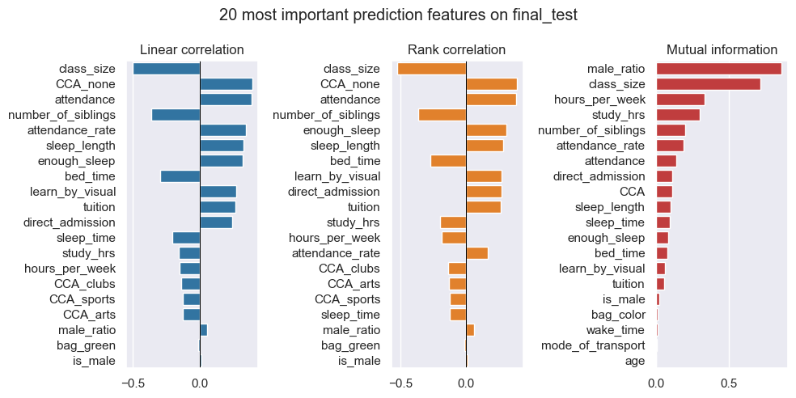
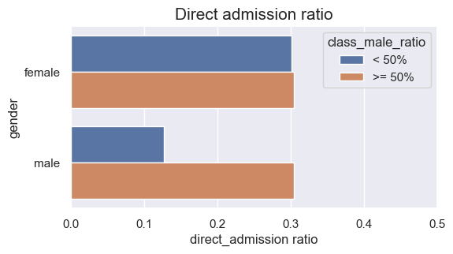

# Student Score Prediction

**Objective**  
- Build model to predict the students' O-level math examination score for U.A Secondary School.

## 0. Folder structure

<pre>. # project folder
├───data # raw data
├───output  
│   ├───predict # model pipeline predict output
│   │   └─── *.csv
│   ├───train # save trained model pipeline as *.pickle
│   │   └─── *.pickle
│   └───transform # model pipeline transform output
│       └─── *.csv
├───params # kwargs for pipeline
│   └─── *.json
├───src # model pipeline source file
│   └─── *.py
├───image  
├───eda.ipynb # EDA notebook
├───model_comparison.ipynb # model comparison and explanation
├───test.ipynb # pipeline testing in notebook
├───example.py # Example command line interface of pipeline
├───requirement.txt
└───README.md</pre>

## 1. Key data cleaning findings

- `sleep_time` & `wake_time` are string type, need to convert to time or number.
- `tuition` has inconsistent entry ['no' 'yes' 'y' 'n'].
- `age` has incorrect entries: [-4, -5, 5, 6]
- Found duplicated `student_id`, mostly have inconsistent `bag_color` or `attendance_rate`.
- `attendance_rate` & `final_test` have null values.

## 2. EDA highlights

Summary of feature importance

- `final_test` score drive factors (they have significant prediction power, but not necessary cause of test result)
    - Positive features
        - `CCA_none`, `attendance_rate`, `sleep_length`, `tuition`, `direct admission`, `learn_by_visual`, `male_ratio`
        - `hours_per_week`
            - Please note the correlation between `hours_per_week` and `final_test` is negative, but I believe it has positive effect. The reason of negative coefficient is due to the student populatoin is a mixture of many types.
    - Negative features
        - `class_size`, `number_of_siblings`, sleep_time`
- Student classification: 3 types
    
    1. High potential
        - Can achieve good `final_test` result with only 5~10 hrs study per week. Even if they don't actively study (0~5 hrs per week) after school, still can get mediocre test result (~75).
            - They don't study more than 10 hrs per week. It is simply not necessary.
        - They are less active in `CCA` and many choose to NOT take any `CCA`
        - Students with `direct_admission` are more likely to be with high potential.
        - Smaller `class_size` and classes with higher male ratio (>50%) have more high potential students. 
    2. Norminal potential
        - Their test results significantly depend on their effort (attend `tuition` and longer study time). But it is almost impossible for them to get top score (>80) even if they study as long as 15~20 hrs per week.
    3. With attitude issue
        - These students typically have lower than normal attendance rate, due to late bed time and not enough sleep.
        - Even if they take `tuition` or study for long time (likely forced by parent?), the effective is NOT significant.
        - Though don't like school, they are surprisingly more active in `CCA`.
- Class gender distribution effect
    - Generally speaking there is no significant difference between boy and girl populations.
    - However male students from male dominant (>50%) classes tend to perform better than male students from female dominant classes.
        - 
        - No such difference can be observed on female students.
    - One reason is that the ratio of male students from `direct_admission` is much lower in female dominant classes than male dominant classes.
        - 
        - `direct_admission` ratio of boys in male dominant classes and girls in both male dominant and female dominant classes are comparable.
    - At this moment it is difficult to conclude if class gender ratio has any significant impact on males' test performance or not.
- Family effect
    - Top performers come mostly from families with 0 or 1 siblings.
    - Worst performers come mostly from families with 1 or 2 siblings.
    - Amount of parent attention is likely the key.

## 3. Model Selection and Pipeline Design

Tree based models (RandomForest, XGB, LGBM), Linear model (ElasticNet) and K Nearest Neighbors model (KNN) are compared in this study.

### Pipeline flow structure for **tree based** models:  
- 0 Load raw data
- 1 Common data cleaning + feature engineering
- 2 Prepare corss-validate datasets (ignore in *transform* and *predict* mode)
    - Split train / val datasets
    - Fill null in `attendance_rate` based on `sleep_length` group median (avoid data leak)
- 3 Fill null values in `attendance_rate`
- 4 Model hyper parameter tuning (ignore in *transform* and *predict* mode)
- 5 Final model training or prediction (ignore in *transform* mode)

### Pipeline flow structure for **KNN** models:  
- 0 Load raw data
- 1 Common data cleaning + feature engineering
- 2 Prepare corss-validate datasets (ignore in *transform* and *predict* mode)
- 3 ***Apply StandardScaler transform to cv datasets*** (ignore in *transform* and *predict* mode)
- 4 Fill null values in attendance_rate
- 5 Model hyper parameter tuning (ignore in *transform* and *predict* mode)
- 6 ***Apply StandardScaler transform to X data*** (ignore in *transform* mode)
- 7 Final model training or prediction (ignore in *transform* mode)

### Pipeline flow structure for **Linear (ElasticNet)** models:  
- 0 Load raw data
- 1 Common data cleaning + feature engineering
- 2 Prepare corss-validate datasets (ignore in *transform* and *predict* mode)
- 3 Apply StandardScaler transform to cv datasets (ignore in *transform* and *predict* mode)
- 4 Fill null values in attendance_rate
- 5 Model hyper parameter tuning (ignore in *transform* and *predict* mode)
    - ***Apply polynominal features transform to X_train data***
    - ***Degree of polynominal transform is tuned as a hyper parameter***
- 6 Apply StandardScaler transform to X data (ignore in *transform* mode)
- 7 ***Apply polynominal features transform to X data*** (ignore in *transform* mode)
- 8 Final model training or prediction (ignore in *transform* mode)

## 4. Model Comparison

### Metric
- Root Mean Square Error (RMSE)
$$\text{RMSE} = \sqrt{\frac{\sum_{i=1}^{N}\left\| y(i)-\hat{y}(i) \right\|^2}{N}}$$

### CV score comparison

|   **Model**  |   RF  |  XGB  |  LGBM | Linear |  KNN  |
|:------------:|:-----:|:-----:|:-----:|:------:|:-----:|
| **CV score** | 5.275 | 5.260 | 5.322 |  7.963 | 7.643 |

- Tree based models (RF, XGB, LGBM) show much better performance than linear and KNN models.

### Feature permutation importance

**NOTE**: Above permutation importance calculation is based on raw data features, NOT including engineered features.

**Key highlights**  
- All tree based models (RF, XGB, LGBM) show similar results
    - This is consistent with the fact that their cv scores are also comparable, indicating they all model the data in similar way.
    - `n_female` and `n_male` are the most important features. This is consistent with our EDA findings that `class_size` and `male_ratio` have high prediction power. The root cause is the ratio of talented (direct admission) male students are assigned to bigger and/or female dominant classes.
- Linear model's 3rd important feature is also `number_of_siblings`, though the abosolute importance value is much lower than tree models.
    - Based on EDA we know `number_of_siblings` has strong prediction power, but the correlation to `final_test` is NOT linear. That explains why linear model underestimate its importance.
- KNN model basically cannot tell the importance of all features.
    - To build successful KNN model, you have to tell the model the importance of all features by scaling. This is one of the main disadvantages of KNN model.
        - Another disadvantage is prediction takes long time especially when the training dataset is big.
    - In my KNN model pipeline, standard scaler is applied to all features. Basically this scaler puts all features in the same scale (importance), so the above permutation importance result is not surprising.
        - `student_id`, `age` and `bag_color` were dropped from X features for all models (due to EDA disproves their prediction power), so of course their permutation importances are all zero.

### Optuna tuning score trend comparison

Compare all tree based models (RF, XGB, LGBM), obviously LGBM model cv score is more consistent and less spike.  
- LGBM model is **less sensitive** to hyper parameters compare to RF and XGB, which I think is a big advantage.